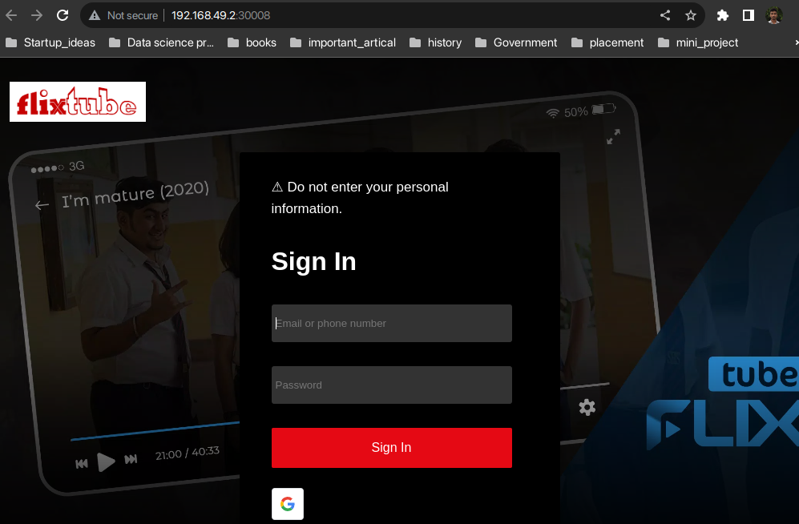
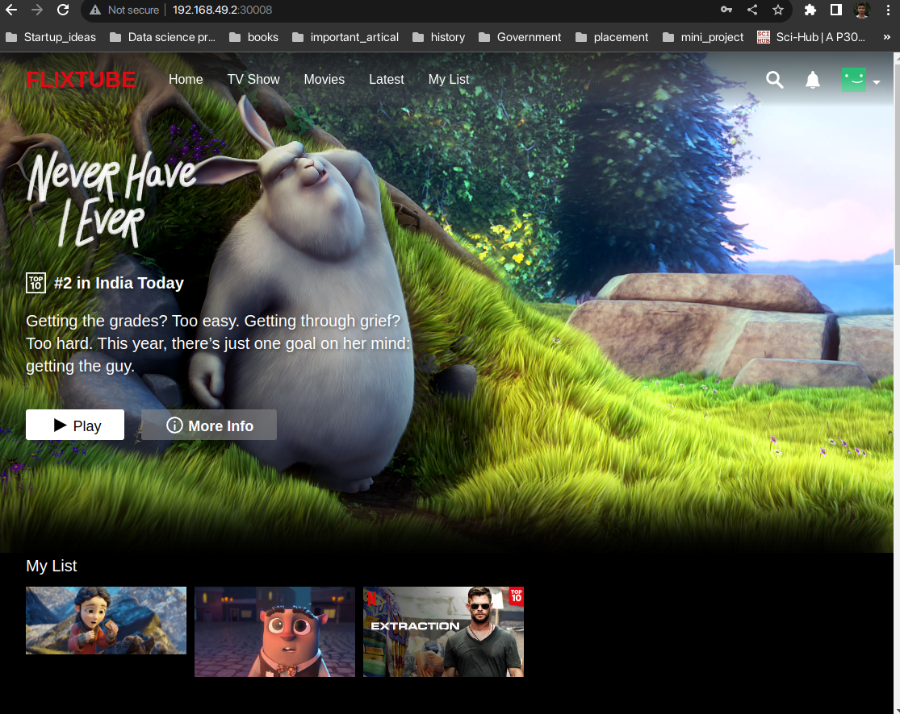

# frontend-microservice

The frontend microservice serves as the initial point of interaction for users visiting your video streaming website. Its primary responsibility is to handle the user interface and provide a smooth and engaging user experience. It plays a pivotal role in authenticating users, displaying content, and routing user requests to other microservices as needed.

## Introduction

The frontend microservice serves as the user-facing component of your video streaming website, providing an intuitive interface for users to interact with. It is responsible for authenticating users, displaying video content, and handling user requests for streaming videos.

## Features

List of main features:
- **User Authentication:** The frontend microservice allows users to log in securely with their credentials. It collects user data and sends it to the authentication microservice for validation.
- **Video Content Display:** It showcases a variety of video posters on the main page, enticing users to explore the available content. Each video poster represents a video that users can watch by clicking on it.
- **Request Routing:** When users click on a video poster, the frontend microservice routes the request to the appropriate microservice responsible for video streaming, ensuring efficient and smooth video playback.

## Installation

## Usage

## Contributing

If you want to contribute to this project, follow these guidelines:
- **Report Bugs:** Open an issue, providing details about the bug encountered, steps to reproduce, and the expected behavior.
- **Feature Requests:** Open an issue to propose new features or improvements you'd like to see in the frontend microservice.
- **Pull Requests:** Submit a pull request with your changes for review and merging. Make sure to follow the coding style and include appropriate tests.

## License

This project is licensed under the [MIT License](LICENSE). You are free to modify and distribute this codebase as per the terms of the license.

## Contact

For any inquiries, you can reach out to the project maintainer at [aakashjob12@gmail.com].

## Output

